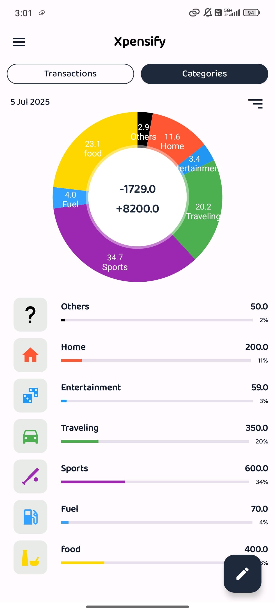
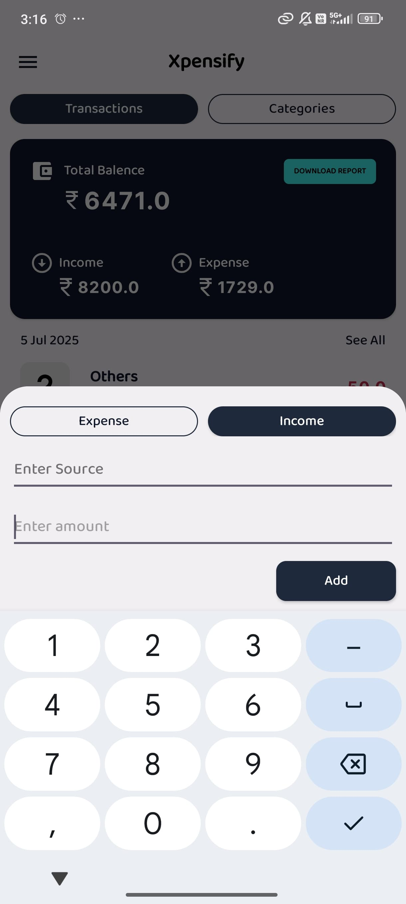

# Xpensify - Expense Manager

Xpensify is a smart financial tracker Android application that helps users manage and track their income and expenses. It features category management, transaction tracking, financial summaries, PDF report generation, and Google Drive backup/restore.

---

## Features

- **Expense & Income Tracking:**  
  Add, view, and manage expenses and incomes with details like amount, date, time, category/source, and notes.

- **Category Management:**  
  Create, edit, and delete categories with custom icons and colors.

- **Financial Summary:**  
  View summaries for daily, weekly, monthly, yearly, or all-time periods, including total income, expenses, and balance.

- **Reports:**  
  Generate PDF financial summary reports for any period.

- **Charts:**  
  Visualize spending by category using pie charts.

- **Google Drive Integration:**  
  Backup and restore your database to/from Google Drive.


---

## Project Structure

```
app/
  ├── src/
  │   └── main/
  │       ├── java/com/example/expensemanager/app/
  │       │   ├── adapters/         # RecyclerView and ListView adapters
  │       │   ├── database/         # Room database, DAOs, entities, repositories, viewmodels
  │       │   ├── dialogs/          # Bottom sheets and dialogs
  │       │   ├── fragments/        # UI fragments (Transactions, Categories, etc.)
  │       │   ├── App.kt            # Application class (icon pack loader)
  │       │   ├── DashBoard.kt      # Main dashboard activity
  │       │   ├── MainActivity.kt   # Splash screen
  │       │   ├── AddCategory.kt    # Add new category activity
  │       │   ├── EditCategories.kt # Edit categories activity
  │       │   ├── NewCategory.kt    # New category activity
  │       │   ├── GenerateReport.kt # PDF report generation
  │       │   └── SharedPreferenceManger.kt # Rewarded ads coins manager
  │       └── res/                  # Layouts, drawables, menus, values, etc.
  ├── build.gradle.kts
  └── proguard-rules.pro
```

---

## Database

- **Room Database:**  
  Defined in [`AppDatabase`](app/src/main/java/com/example/expensemanager/app/database/AppDatabase.kt).
- **Entities:**  
  - [`Category`](app/src/main/java/com/example/expensemanager/app/database/Category.kt)
  - [`Expense`](app/src/main/java/com/example/expensemanager/app/database/Expense.kt)
  - [`Income`](app/src/main/java/com/example/expensemanager/app/database/Income.kt)
- **DAOs:**  
  - [`CategoryDao`](app/src/main/java/com/example/expensemanager/app/database/CategoryDao.kt)
  - [`ExpenseDao`](app/src/main/java/com/example/expensemanager/app/database/ExpenseDao.kt)
  - [`IncomeDao`](app/src/main/java/com/example/expensemanager/app/database/IncomeDao.kt)
  - [`TransactionDao`](app/src/main/java/com/example/expensemanager/app/database/TransactionDao.kt)
- **Prepopulated Data:**  
  Default categories, expenses, and incomes are inserted on first run.

---

## Screenshots

Below is a gallery of Xpensify app screens. Each screenshot is labeled for clarity.

<table>
  <tr>
    <td align="center"><br/>Dashboard</td>
    <td align="center"><br/>Transactions</td>
    <td align="center"><br/>Add Expense</td>
  </tr>
    <tr>
    <td align="center"><br/>PDF Report</td>
    <td align="center"><br/>Google Drive Backup</td>
    <td align="center"><br/>Rewarded Ads</td>
  </tr>
  <tr>
    <td align="center"><br/>Categories</td>
    <td align="center"><br/>Summary</td>
    <td align="center"><br/>Pie Chart</td>
  </tr>

</table>

---

**Developer : [Sameer Shaikh](https://github.com/Sameer377/)**
